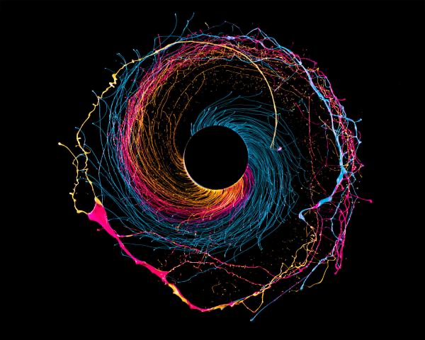

# Sapajañña

Sapajañña is my personal blog. A place to express through words and drawings those ideas that arise when deep diving into stillness.

[See the live demo](https://thirsty-allen-1ea1f9.netlify.app)

## About this repo

This websites uses:

- [Yarn](https://yarnpkg.com/) as package manager;
- [GatsbyJS](https://github.com/gatsbyjs/gatsby) as website generator;
- [gatsby-source-datocms](https://github.com/datocms/gatsby-source-datocms) to integrate the website with DatoCMS.
